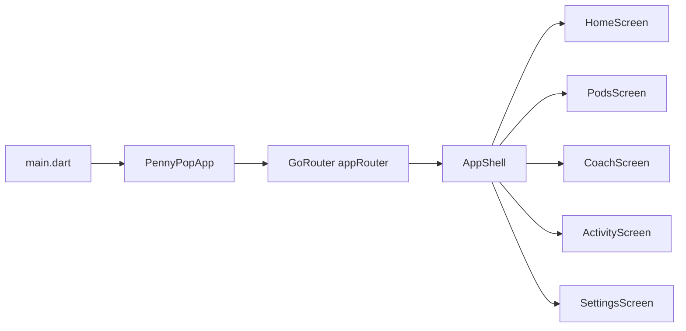

# Chunk 1 — Repo + App Shell (Flutter)

## Goal

- App boots successfully and provides navigation between **Home**, **Pods**, **Coach**, **Activity**, **Settings** placeholder screens.
- Use **BottomNavigationBar** + **go_router**.

## Files to change / add

- Update: [`/Volumes/Crucial X10/other-work/Penny Pixel Pop/penny_pop_app/pubspec.yaml`](/Volumes/Crucial%20X10/other-work/Penny%20Pixel%20Pop/penny_pop_app/pubspec.yaml)
- Add `go_router` dependency.
- Update: [`/Volumes/Crucial X10/other-work/Penny Pixel Pop/penny_pop_app/lib/main.dart`](/Volumes/Crucial%20X10/other-work/Penny%20Pixel%20Pop/penny_pop_app/lib/main.dart)
- Replace the counter app with `runApp(const PennyPopApp())`.
- Add: `lib/app/penny_pop_app.dart`
- `MaterialApp.router(...)` wired to the app router config.
- Add: `lib/routing/app_router.dart`
- Configure a `StatefulShellRoute.indexedStack` with 5 branches (one per tab) so each tab has its own navigator stack.
- Define canonical paths: `/` (Home), `/pods`, `/coach`, `/activity`, `/settings`.
- Add: `lib/shell/app_shell.dart`
- A `Scaffold` that renders the active branch (`navigationShell`) and a `BottomNavigationBar` that switches tabs via `navigationShell.goBranch(index, initialLocation: ...)`.
- Add: `lib/screens/{home,pods,coach,activity,settings}_screen.dart`
- 5 simple `Scaffold` placeholders (AppBar title + centered text).
- Update: [`/Volumes/Crucial X10/other-work/Penny Pixel Pop/penny_pop_app/test/widget_test.dart`](/Volumes/Crucial%20X10/other-work/Penny%20Pixel%20Pop/penny_pop_app/test/widget_test.dart)
- Replace the counter smoke test with a navigation smoke test (verify each tab can be tapped and its placeholder text appears).

## Routing approach (high level)

- **Root**: `PennyPopApp` uses `MaterialApp.router(routerConfig: appRouter)`.
- **Shell**: `StatefulShellRoute.indexedStack` provides 5 tab branches.
- **UI**: `AppShell` hosts the `BottomNavigationBar` and the branch content.

## Manual verification (after implementation)

- Run `flutter pub get`.
- Run `flutter run` (device/simulator).