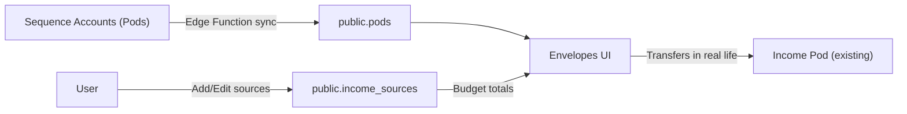

# Income Sources (Budget-Only)

## Goals

- **Track multiple income sources for budgeting** (name + budgeted amount).
- **No changes to Sequence sync / pod sequencing**: money still lands in your existing Income pod; sources are budget metadata only.
- **UX**: In the Envelopes screen, the **Income section shows sources** and has a **“+ New” row at the bottom** to add another source (YNAB-style).

## Data model (Supabase)

- Add a new table `public.income_sources` keyed by household.
- Columns: `id uuid`, `household_id uuid`, `name text`, `budgeted_amount_in_cents bigint`, `is_active bool`, `sort_order int`, timestamps.
- Unique: `(household_id, name)`.
- RLS: allow select/write for authenticated users who are members of the household (mirrors how `pods`/`pod_settings` are scoped).

**Files**

- Add new migration in [`supabase/migrations`](supabase/migrations/) (next timestamp).

## App changes (Flutter)

### 1) Client models + service

- Add an `IncomeSource` model and `IncomeSourcesService` that:
- `listIncomeSources(householdId)`
- `upsertIncomeSource(...)`
- `deleteIncomeSource(id)` or `set is_active=false` (soft delete)

**Files**

- Add: [`lib/income/income_models.dart`](lib/income/income_models.dart)
- Add: [`lib/income/income_service.dart`](lib/income/income_service.dart)

### 2) Envelopes screen UI: Income section becomes sources + “+ New” row

- Update [`lib/screens/pods_screen.dart`](lib/screens/pods_screen.dart):
- Load both pods and income sources for the active household.
- Compute `totalIncomeCents` as:
    - if income sources exist: **sum of sources’ `budgeted_amount_in_cents`**
    - else (back-compat): sum of Income-category pods’ budgets (current behavior)
- Render Income section with:
    - Rows for each income source: **Name | Budget Amount | Left to Earn**
    - For v1, `Left to Earn` = `budgeted_amount_in_cents` (since we don’t have per-source actuals yet).
    - Bottom row: **“+ New”** (tap opens an “Add income source” sheet).
- Add an edit sheet for income sources (reuse the existing money parsing/formatting patterns from `_PodBudgetSheet`).

**Note on pods**

- Pods remain synced from Sequence as-is.
- When income sources exist, the Income section UI is driven by sources to avoid confusion.
- (Optional, v2) If you still want to show the actual Income pod, we can add a small “Income pod balance” row in the Income header without treating it as a source.

### 3) Data flow diagram

## Acceptance criteria

- You can add multiple income sources in the Income section using **“+ New”**.
- Sources persist per household and sync across devices (Supabase).
- Budget summary (`Total Income`, `% of income`, `Unassigned`) uses sources when present.
- No changes to pods sync or ordering; Sequence integration unaffected.

## Rollout / migration safety

- Migration is additive only.
- UI keeps legacy behavior if no income sources exist yet.

## Testing