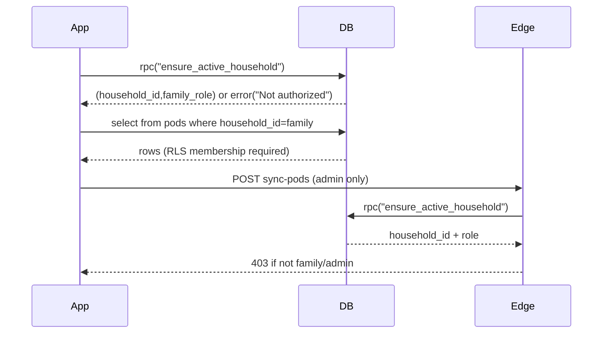

# Family-only access lock

## What’s broken today

- `public.ensure_active_household()` currently **auto-creates a household** and inserts `(user_id, role='admin')` when a user has no membership. That makes any signed-in user an admin of *some* household.
- The Edge Function [`supabase/functions/sync-pods/index.ts`](/Volumes/Crucial%20X10/other-work/Penny%20Pixel%20Pop/penny_pop_app/supabase/functions/sync-pods/index.ts) uses a **global** `SEQUENCE_ACCESS_TOKEN` + **service role** to write pods. So an “admin of any household” can import your family Sequence pods into their own household.

## Target behavior

- Only users who are members of household `4b7c62d7-7584-4665-a1e7-991700d4d30c` can:
- load an active household in the app
- read pods (already enforced by RLS)
- run `sync-pods`
- Everyone else signs in but gets a clean “Not authorized” experience (no data access).

## Implementation plan

### 1) Database: make `ensure_active_household()` “family household only”

- Add a new migration in [`supabase/migrations/`](/Volumes/Crucial%20X10/other-work/Penny%20Pixel%20Pop/penny_pop_app/supabase/migrations) that **replaces** `public.ensure_active_household()`.
- New logic:
- `v_user_id := auth.uid()`
- look up membership **only** for household `4b7c62d7-7584-4665-a1e7-991700d4d30c`
- if not a member: `raise exception 'Not authorized'`
- do **not** create any household, do **not** insert membership rows

### 2) Edge Function: block sync unless the active household is the family household

- Update [`supabase/functions/sync-pods/index.ts`](/Volumes/Crucial%20X10/other-work/Penny%20Pixel%20Pop/penny_pop_app/supabase/functions/sync-pods/index.ts):
- After `ensure_active_household` returns `householdRow`, require:
    - `householdRow.household_id == '4b7c62d7-7584-4665-a1e7-991700d4d30c'`
    - `householdRow.role == 'admin'` (already present)
- Map “Not authorized” failures from the RPC to **HTTP 403** (instead of 400/401), so the client gets a clear signal.

### 3) App UX: handle “Not authorized” cleanly

- Update [`lib/households/household_service.dart`](/Volumes/Crucial%20X10/other-work/Penny%20Pixel%20Pop/penny_pop_app/lib/households/household_service.dart) / `ActiveHouseholdController` so when `ensure_active_household` throws “Not authorized”, the app:
- does not treat the user as admin
- shows a friendly “Not authorized / ask family admin to add you” message (or auto-signs out—your choice during implementation)

### 4) Operational hardening (recommended)

- Supabase Auth:
- disable public signups (invite-only) or restrict allowed email domains/providers
- Cleanup:
- remove any households/pods created by unintended accounts (since they may already have imported Sequence pods)

### 5) Verify

- Test with:
- a family member account (member): can view pods, cannot sync
- a family admin account: can view + sync
- a random account: sign-in works but **cannot** load household, **cannot** sync, **cannot** see pods

## Data flow (after fix)

