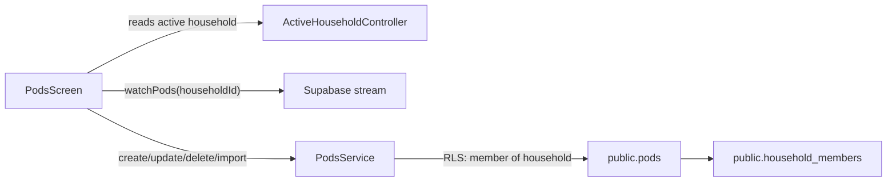

# Pods CRUD + Category Mapping (Household-scoped)

## Scope / outcomes

- Add a new Supabase table `pods (household_id, name, category, notes)` (plus minimal supporting columns) with **RLS** so **any household member** can read/write.
- Replace the placeholder `PodsScreen` with:
- Household-scoped list (reads from Supabase)
- Add/Edit form (name, category, notes)
- Delete with confirmation
- “Import defaults” button that inserts/updates your provided default pods idempotently

## Database (Supabase) changes

- Add a new migration in `[supabase/migrations/]( /Volumes/Crucial X10/other-work/Penny Pixel Pop/penny_pop_app/supabase/migrations ) `to create `public.pods`.
- **Columns**:
    - `id uuid primary key default gen_random_uuid()`
    - `household_id uuid not null references public.households(id) on delete cascade`
    - `name text not null`
    - `category text not null check (category in ('Savings','Kiddos','Necessities','Pressing','Discretionary'))`
    - `notes text null`
    - `created_at timestamptz not null default now()`
    - `updated_at timestamptz not null default now()` (maintained via trigger)
- **Uniqueness** (for safe default imports and nicer UX):
    - `unique (household_id, name)`
- **Integrity**:
    - Trigger to prevent changing `household_id` on update (raises exception if it changes)
    - Trigger to auto-update `updated_at`
- Enable RLS and add policies consistent with existing household membership patterns in your migrations:
- **SELECT**: allowed if `exists (select 1 from household_members hm where hm.household_id = pods.household_id and hm.user_id = auth.uid())`
- **INSERT**: same condition in `with check`
- **UPDATE**: `using` + `with check` same condition
- **DELETE**: `using` same condition

## Flutter data layer

- Add a small pods module:
- `[lib/pods/pod.dart]( /Volumes/Crucial X10/other-work/Penny Pixel Pop/penny_pop_app/lib/pods/pod.dart )`
    - `enum PodCategory { savings, kiddos, necessities, pressing, discretionary }`
    - mapping functions `toDbString()` / `fromDbString()` and a `label`
    - `class Pod { id, householdId, name, category, notes }`
- `[lib/pods/pods_service.dart]( /Volumes/Crucial X10/other-work/Penny Pixel Pop/penny_pop_app/lib/pods/pods_service.dart )`
    - `Stream<List<Pod>> watchPods(householdId)` using `supabase.from('pods').stream(primaryKey: ['id']).eq('household_id', householdId).order('category').order('name')`
    - `Future<void> createPod(...)`, `updatePod(...)`, `deletePod(id)`
    - `Future<void> importDefaults(householdId)` using `upsert` on `(household_id, name)`
- Hardcode your provided defaults in something like `[lib/pods/default_pods.dart]( /Volumes/Crucial X10/other-work/Penny Pixel Pop/penny_pop_app/lib/pods/default_pods.dart ) `as a list of `{category, name}`:
- Savings: Safety Net, SoFi Savings, Robinhood Investing, Move to ___
- Pressing: Car Maintenance, Vivint, Credit Cards, Juice Box, House Cleaning, Mowing, Clothing, Toiletries
- Necessities: Car Gas, Car Insurance, Car Payment, Electric - AES, Gas & Water - Citizens, Phones, Wifi, Sequence Billing, Groceries, Rent, Health
- Kiddos: Education, Greenlight Kids
- Discretionary: Streaming Services, Eat Out, Birthday Money, Art

## UI changes

- Update `[lib/screens/pods_screen.dart]( /Volumes/Crucial X10/other-work/Penny Pixel Pop/penny_pop_app/lib/screens/pods_screen.dart )` from placeholder to full CRUD:
- Read `active household` via `PennyPopScope.householdOf(context)` (existing pattern)
- If household not loaded / error, show retry (call `household.refresh()`)
- Otherwise, show pods list (grouped by category or sorted with category headers)
- **Add**: Floating action button opens a modal bottom sheet form
- **Edit**: tap a pod to open same form pre-filled
- **Delete**: from edit form or trailing menu with confirmation dialog
- **Import defaults**: button near top (AppBar action or prominent empty-state button) that confirms then calls `importDefaults(activeHouseholdId)` and shows a snackbar
- Optional but recommended UX alignment: rename the bottom tab label from `Budgets` to `Pods` in `[lib/shell/app_shell.dart]( /Volumes/Crucial X10/other-work/Penny Pixel Pop/penny_pop_app/lib/shell/app_shell.dart ) `since that tab routes to `/pods`.

## Data flow (high level)

## Acceptance checklist (matches your Exit)

- Add/edit/delete pods works in-app.
- Pods are persisted in `public.pods` with `household_id` set for every row.
- Both household members can view and manage the same pod list.