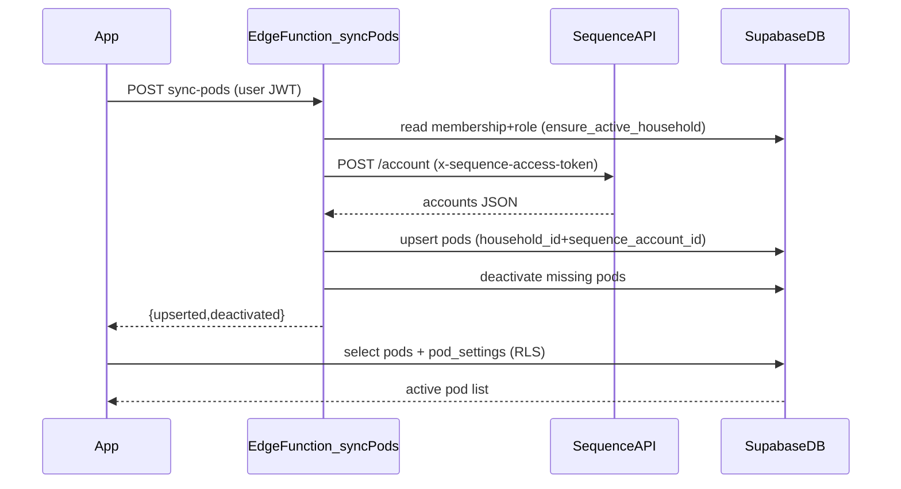

# Chunk 4 — Pods Sync + Metadata (Household-scoped)

## Why this fits your current app

- You already have **household membership + roles** (`admin`/`member`) and the app can read them via `ensure_active_household()`.
- Sequence’s API supports fetching accounts via **POST `/account`** using **`x-sequence-access-token: Bearer <token>`** under base URL **`https://api.getsequence.io`** (per the provided docs).
- You selected: **Edge Function** for sync, **single shared Sequence token (v1)**, and **both household members can edit category/notes**.

## Data model (Supabase migrations)

Files:

- Add new migration: `supabase/migrations/2026xxxxxx_pods_sync_v1.sql`

### `pods`

- Columns:
- `id uuid primary key default gen_random_uuid()`
- `household_id uuid not null references public.households(id) on delete cascade`
- `sequence_account_id text not null`
- `name text not null`
- `is_active boolean not null default true`
- `last_seen_at timestamptz not null default now()`
- (optional) `created_at timestamptz not null default now()`
- Constraints / indexes:
- **unique** `(household_id, sequence_account_id)` (this is the identity)
- index `(household_id, is_active)` for the “active only” list

### `pod_settings`

- 1:1 metadata row per pod (owned by your app)
- Columns:
- `pod_id uuid primary key references public.pods(id) on delete cascade`
- `category text` with CHECK in: `Savings, Kiddos, Necessities, Pressing, Discretionary` (allow null for v1)
- `notes text`
- (optional) `updated_at timestamptz not null default now()`

### RLS policies

Enable RLS on both tables.

- `pods`
- **SELECT** allowed to authenticated users who are members of `pods.household_id`.
- No INSERT/UPDATE/DELETE policies (sync is via service role in Edge Function).
- `pod_settings`
- **SELECT/INSERT/UPDATE/DELETE** allowed to authenticated users who are members of the pod’s household (via `pods.household_id` join).
- This matches “both members can edit category/notes.”

## Backend: Supabase Edge Function `sync-pods`

Files:

- Add `supabase/functions/sync-pods/index.ts`

### Environment/secrets

- Store the Sequence token as a Supabase Function secret (v1): `SEQUENCE_ACCESS_TOKEN`.
- Use built-in Supabase env vars for URL/keys (`SUPABASE_URL`, `SUPABASE_ANON_KEY`, `SUPABASE_SERVICE_ROLE_KEY`).

### Request/response

- **HTTP**: `POST /functions/v1/sync-pods` (invoked via `supabase.functions.invoke('sync-pods')`)
- **Auth**: require user JWT (sent automatically by Supabase client)
- Response: JSON with counts `{ upserted, deactivated }` and maybe `seenIdsCount`.

### Authorization (admin-only)

Inside the Edge Function:

- Validate the caller with the **anon client** (use request Authorization header).
- Determine the caller’s active household + role:
- Option A (simple): call `ensure_active_household()` via RPC using the user token.
- Reject if role != `admin`.

### Sync algorithm

1. Call Sequence:

- `POST https://api.getsequence.io/account`
- Headers:
    - `x-sequence-access-token: Bearer ${SEQUENCE_ACCESS_TOKEN}`
    - `Content-Type: application/json`
- Body: `{}`

2. Parse JSON and extract accounts of `type == 'Pod'`.

- Be defensive on field names for the id (use first present of `id`, `accountId`, `account_id`) and name (`name`).

3. Upsert into `pods` for the active household:

- On conflict `(household_id, sequence_account_id)` update `name`, set `is_active=true`, set `last_seen_at=now()`.

4. Mark missing pods inactive (don’t delete):

- `is_active=false` for rows in that household whose `sequence_account_id` is not in the fetched set.

### Notes about single-token v1

- With a **single global token**, multiple households would sync the same underlying Sequence account set if they invoke sync.
- The storage is still household-scoped (`pods.household_id`), so partners inside a household see the same pods; moving to per-household tokens later is straightforward (add `households.sequence_access_token` or a `sequence_connections` table).

## Flutter UI

Files:

- Update `lib/screens/pods_screen.dart`
- Add a small pods domain layer:
- `lib/pods/pods_service.dart`
- (optional) `lib/pods/models.dart` (Pod + PodSettings)

### Pods screen behavior

- **No Add Pod button** (none exists today; keep it that way).
- Show a helper message: “Create pods in Sequence, then tap Sync.”
- **Sync from Sequence** button:
- Visible/enabled only if `PennyPopScope.householdOf(context).active?.role == 'admin'`.
- Calls `supabase.functions.invoke('sync-pods')`, then refreshes the list.
- List pods from `pods`:
- Default filter: `is_active == true`
- Optional toggle to “Show inactive” (keeps v1 lightweight while meeting ‘active only by default’).
- Tap a pod → edit `category + notes`:
- Implement as a modal bottom sheet (keeps routing unchanged) with:
    - category dropdown (the 5 options)
    - notes text field
    - save button that **upserts** into `pod_settings` (keyed by `pod_id`)

## Data flow diagram

