# Chunk 2 — Supabase Project + Google-only Auth (iOS)

## Outcome

- Users can **sign in with Google** (only) and get a **Supabase session**.
- Session **persists across app restarts**.
- **Settings** shows the user’s **email** and a **Sign out** button.

## Key decisions (confirmed)

- **Platform**: iOS only
- **Auth flow**: Native `google_sign_in` → `supabase_flutter` `signInWithIdToken` (no browser redirect UX)

## External setup (Supabase + Google Cloud)

### 1) Supabase project

- Create a Supabase project.
- Copy these (we’ll wire them into Flutter via `--dart-define`):
- `SUPABASE_URL`
- `SUPABASE_ANON_KEY`

### 2) Supabase Auth: enable Google provider

- In Supabase dashboard: **Authentication → Providers → Google**
- Enable Google.
- You will need a **Google OAuth Web client** to provide:
    - **Client ID**
    - **Client Secret**
- If the Supabase UI has a field like **“Authorized Client IDs”** (or similar), add the **iOS OAuth Client ID** there so Supabase will accept ID tokens minted for your native iOS app.

### 3) Google Cloud Console

- Create/select a Google Cloud project.
- Configure **OAuth consent screen** (External) with scopes: `openid`, `email`, `profile`.

Create **OAuth client IDs**:

- **Web application client** (for Supabase provider settings)
- Add **Authorized redirect URI**:
    - `https://<YOUR_SUPABASE_PROJECT_REF>.supabase.co/auth/v1/callback`
- **iOS client** (for native sign-in)
- Bundle ID: **`com.pennypixelpop.app`** (from `ios/Runner.xcodeproj`)

Copy these values (we’ll use them in Flutter):

- `GOOGLE_IOS_CLIENT_ID` (from the iOS OAuth client)
- `GOOGLE_WEB_CLIENT_ID` (from the web OAuth client)
- `REVERSED_CLIENT_ID` (derived from iOS client; used as iOS URL scheme)

## Flutter implementation plan

### A) Dependencies

- Add:
- `supabase_flutter`
- `google_sign_in`

Files:

- [`/Volumes/Crucial X10/other-work/Penny Pixel Pop/penny_pop_app/pubspec.yaml`](/Volumes/Crucial%20X10/other-work/Penny%20Pixel%20Pop/penny_pop_app/pubspec.yaml)

### B) Initialize Supabase early (persistent session)

- Update [`/Volumes/Crucial X10/other-work/Penny Pixel Pop/penny_pop_app/lib/main.dart`](/Volumes/Crucial%20X10/other-work/Penny%20Pixel%20Pop/penny_pop_app/lib/main.dart) to:
- `WidgetsFlutterBinding.ensureInitialized()`
- `await Supabase.initialize(url: ..., anonKey: ...)`
- `runApp(...)`
- Use `--dart-define` for config:
- `SUPABASE_URL`
- `SUPABASE_ANON_KEY`
- `GOOGLE_IOS_CLIENT_ID`
- `GOOGLE_WEB_CLIENT_ID`

### C) Auth gate via GoRouter redirect

- Add a `/login` route that shows a minimal login screen.
- Add a `redirect` in the router:
- If **signed out** and trying to access anything but `/login` → send to `/login`
- If **signed in** and on `/login` → send to `/`
- Ensure router refreshes when auth state changes by wiring a `ChangeNotifier` that listens to `supabase.auth.onAuthStateChange`.

Files:

- Refactor [`/Volumes/Crucial X10/other-work/Penny Pixel Pop/penny_pop_app/lib/routing/app_router.dart`](/Volumes/Crucial%20X10/other-work/Penny%20Pixel%20Pop/penny_pop_app/lib/routing/app_router.dart) from a top-level `final GoRouter appRouter = ...` into a `GoRouter createAppRouter()` factory.
- Update [`/Volumes/Crucial X10/other-work/Penny Pixel Pop/penny_pop_app/lib/app/penny_pop_app.dart`](/Volumes/Crucial%20X10/other-work/Penny%20Pixel%20Pop/penny_pop_app/lib/app/penny_pop_app.dart) to hold a single router instance (likely via `StatefulWidget` + `initState`) so it isn’t recreated on every rebuild.

### D) Login UI (one button)

- Add a new screen: `LoginScreen` with a single **“Continue with Google”** button.
- On tap:
- Call `GoogleSignIn(...).signIn()`
- Fetch `idToken` + `accessToken`
- Call `Supabase.instance.client.auth.signInWithIdToken(provider: OAuthProvider.google, idToken: ..., accessToken: ...)`

Files:

- Add [`/Volumes/Crucial X10/other-work/Penny Pixel Pop/penny_pop_app/lib/screens/login_screen.dart`](/Volumes/Crucial%20X10/other-work/Penny%20Pixel%20Pop/penny_pop_app/lib/screens/login_screen.dart)

### E) Settings: email + sign out

- Update Settings to show:
- **Email** from `Supabase.instance.client.auth.currentUser?.email`
- **Sign out** button
    - `await Supabase.instance.client.auth.signOut()`
    - and **optionally** `await GoogleSignIn(...).signOut()` (recommended to keep behavior “fully signed out”)

Files:

- Update [`/Volumes/Crucial X10/other-work/Penny Pixel Pop/penny_pop_app/lib/screens/settings_screen.dart`](/Volumes/Crucial%20X10/other-work/Penny%20Pixel%20Pop/penny_pop_app/lib/screens/settings_screen.dart)

### F) iOS native config for Google Sign-In

- Add URL scheme for Google callback in iOS `Info.plist`:
- `CFBundleURLTypes` → `CFBundleURLSchemes` includes `REVERSED_CLIENT_ID` (looks like `com.googleusercontent.apps.<...>`)

Files:

- Update [`/Volumes/Crucial X10/other-work/Penny Pixel Pop/penny_pop_app/ios/Runner/Info.plist`](/Volumes/Crucial%20X10/other-work/Penny%20Pixel%20Pop/penny_pop_app/ios/Runner/Info.plist)

## Data flow (high level)

```mermaid
flowchart LR
  appStart["AppStart"] --> supabaseInit["SupabaseInitialize"]
  supabaseInit --> router["GoRouterWithAuthRedirect"]
  router -->|"NoSession"| login["LoginScreen"]
  login --> google["GoogleSignIn"]
  google --> supabaseAuth["SupabaseSignInWithIdToken"]
  supabaseAuth -->|"SessionStored"| routerRefresh["AuthStateChangeRefresh"]
  routerRefresh -->|"HasSession"| appShell["AppShellTabs"]
  appShell --> settings["SettingsEmailAndSignOut"]
  settings -->|"SignOut"| signedOut["SupabaseSignOut+GoogleSignOut"]
  signedOut --> routerRefresh
```

## Acceptance checklist

- Tap **Continue with Google** → lands in the app (any tab) with a valid session.
- Kill app → relaunch → still signed in (no re-prompt).
- Settings shows **email** and **Sign out**.
- Sign out returns to Login and session is cleared.

## What I’ll need from you when implementing

- `SUPABASE_URL` and `SUPABASE_ANON_KEY`
- Google OAuth:
- Web client ID + secret (for Supabase provider)
- iOS client ID