# Chunk 3 — Household + Membership (Minimal, Partner-ready)

## Goal

Enable two people to sign in with separate Google accounts and see **the same shared household context** (household id/name) in-app, backed by Supabase tables + RLS.

## Supabase (CLI migrations)

### 1) Add migrations scaffolding

- Create a `supabase/` project in-repo (if you don’t already have one):
- `supabase init`
- `supabase link --project-ref <YOUR_REF>`

### 2) Migration: `profiles` (email → user id mapping)

Because v1 “Add partner” accepts **email**, we need a safe way to resolve `email -> user_id` without client access to `auth.users`.

- Add a migration creating `public.profiles`:
- `id uuid primary key references auth.users(id) on delete cascade`
- `email text not null unique`
- `created_at timestamptz not null default now()`
- Add `handle_new_user` trigger (on `auth.users` insert) to upsert into `public.profiles`.
- Enable RLS on `public.profiles`.
- Allow users to `select` their own row.
- Keep broader reads locked down (no global email directory).

### 3) Migration: `households` + `household_members`

Create:

- `public.households`
- `id uuid primary key default gen_random_uuid()`
- `name text not null default 'Lemon Household'`
- `created_by uuid not null references auth.users(id)`
- `created_at timestamptz not null default now()`
- `public.household_members`
- `household_id uuid not null references public.households(id) on delete cascade`
- `user_id uuid not null references auth.users(id) on delete cascade`
- `role text not null check (role in ('admin','member'))`
- `created_at timestamptz not null default now()`
- `primary key (household_id, user_id)`
- index on `user_id`

### 4) RLS policies (minimal + safe)

- `households`:
- `select`: allowed if `exists (select 1 from household_members where household_id = households.id and user_id = auth.uid())`
- `household_members`:
- `select`: allowed if user is a member of the household.
- inserts/updates/deletes: routed through RPC (below) to keep rules simple and admin-gated.

### 5) RPC functions (Postgres)

Add **security definer** functions:

- `public.ensure_active_household()`
- Behavior:
    - If `auth.uid()` already has a membership row, return that `household_id`, household `name`, and the member `role`.
    - Else create a new household (default name), insert membership row with role `admin`, return the same.
- This satisfies: “On first login: create household + add admin.”
- `public.add_household_member_by_email(p_household_id uuid, p_email text)`
- Behavior:
    - Verify caller is `admin` for `p_household_id`.
    - Look up `user_id` from `public.profiles` by normalized email.
    - Insert `(p_household_id, user_id, 'member')` into `household_members`.
    - Return inserted member info (or a useful error if not found).
- This supports the manual v1 “Add partner” flow.

## Flutter app changes

### 1) App state: store `active_household_id`

- Add a small app-state object (no new dependencies) that holds:
- `activeHouseholdId`
- `activeHouseholdName`
- `myRole` (`admin`/`member`)
- On auth session established/restored, call `rpc('ensure_active_household')` and update state.
- On sign-out, clear household state.

Files to touch:

- [`/Volumes/Crucial X10/other-work/Penny Pixel Pop/penny_pop_app/lib/app/penny_pop_app.dart`](/Volumes/Crucial%20X10/other-work/Penny%20Pixel%20Pop/penny_pop_app/lib/app/penny_pop_app.dart) (instantiate and wire app state alongside existing auth notifier)
- Add new:
- `lib/households/household_service.dart` (RPC calls)
- `lib/households/active_household.dart` (model)
- `lib/app/penny_pop_scope.dart` (InheritedNotifier/InheritedWidget to access state from screens)

### 2) Settings: show household name/id + role

Update Settings to include a “Household” section:

- `Household name`
- `Household id`
- `My role`

Files:

- [`/Volumes/Crucial X10/other-work/Penny Pixel Pop/penny_pop_app/lib/screens/settings_screen.dart`](/Volumes/Crucial%20X10/other-work/Penny%20Pixel%20Pop/penny_pop_app/lib/screens/settings_screen.dart)

### 3) “My info” screen (copyable)

Add a simple screen that displays:

- current `user.id` (UUID)
- current `user.email`
- copy-to-clipboard actions

### 4) “Add partner” screen (admin-only)

Add a simple screen reachable from Settings when `role == admin`:

- Input: partner email
- Action: calls `add_household_member_by_email(activeHouseholdId, email)`
- Success: confirmation + optionally show the resolved user id
- Error states:
- partner hasn’t signed in yet (no profile)
- already a member

Routing:

- Update [`/Volumes/Crucial X10/other-work/Penny Pixel Pop/penny_pop_app/lib/routing/app_router.dart`](/Volumes/Crucial%20X10/other-work/Penny%20Pixel%20Pop/penny_pop_app/lib/routing/app_router.dart) to add nested routes under `/settings`:
- `/settings/me`
- `/settings/add-partner`

## Data flow (high level)

```mermaid
flowchart LR
  appStart["AppStart"] --> supaSession["SupabaseSessionRestoredOrLogin"]
  supaSession --> ensure["rpc:ensure_active_household"]
  ensure --> appState["active_household_id+role set"]
  appState --> settings["Settings shows household id/name"]
  settings --> addPartner["Admin adds partner by email"]
  addPartner --> rpcAdd["rpc:add_household_member_by_email"]
  rpcAdd --> membership["household_members row inserted"]
```

## Exit checklist mapping

- User A signs in → `ensure_active_household` creates household + admin membership.
- User B signs in → profile row exists; admin adds them via email → membership created.
- Both open app → Settings shows same household id/name.
- Supabase shows 1 household row + 2 membership rows.

## How you’ll run/apply

- After adding migration files: